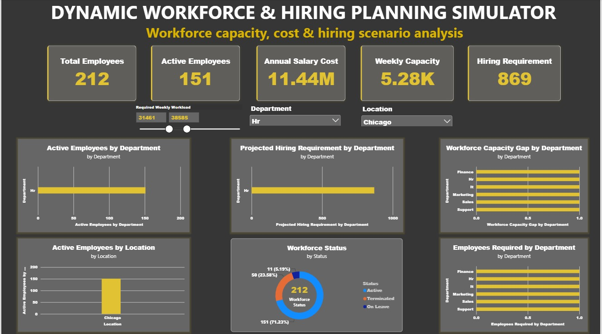

# Dynamic Workforce & Hiring Planning Simulator

A data analytics project built with **Python, MySQL, Excel, and Power BI** to analyze workforce capacity, costs, staffing gaps, and projected hiring requirements under different workload scenarios.

The project follows a practical analytics workflow, starting with messy employee data and ending with an interactive Power BI hiring simulator.

---

## Dashboard Screenshot



---

## Project Overview

The project analyzes:

- **Workforce headcount**
- **Employee capacity**
- **Workforce costs**
- **Department and location distribution**
- **Capacity shortages**
- **Projected hiring requirements**
- **Workload-based hiring scenarios**

### Project Workflow

```text
Raw Workforce Data
        |
        v
Python / Pandas
Data Cleaning & Validation
        |
        v
MySQL
Workforce Analysis & Business Logic
        |
        v
Power BI
Dashboard & Hiring Simulator

Tech Stack
Technology	Purpose
Python / Pandas	Data cleaning and validation
MySQL	Data storage and workforce analysis
Power BI	Dashboard and scenario analysis
Excel / CSV	Source and processed data


Dataset
The dataset contains approximately 12,500 employee records with the following fields:
Column	Description
Emp_ID	Employee identifier
Department	Employee department
Location	Employee location
Hire_Date	Employee hiring date
Status	Employment status
Base_Salary_USD	Annual base salary
Weekly_Capacity_Hrs	Available weekly working hours
Performance_Rating	Employee performance rating


The dataset intentionally contains messy text, missing values, and numerical outliers to simulate a realistic data-cleaning workflow.
Phase 1: Python Data Cleaning
Using Python and Pandas, I:
- Inspected data types and missing values
- Standardized text fields
- Removed unnecessary whitespace
- Handled missing categorical values
- Imputed missing performance ratings
- Identified invalid salary and capacity values
- Converted hiring dates to datetime
- Validated the cleaned dataset
- Exported the processed data to Excel and CSV
Phase 2: MySQL Workforce Analysis
The cleaned dataset was imported into MySQL for business analysis.
Headcount Analysis
- Total employees
- Active employees
- Workforce status distribution
- Department-wise headcount
- Location-wise headcount
Workforce Cost
- Average salary
- Total annual salary cost
- Department-level salary cost
- Department-level average salary
Workforce Capacity
- Total weekly capacity
- Department-level capacity
- Average employee capacity
Hiring Analysis
The project compares required workload against available workforce capacity.
Capacity Gap = Required Hours - Available Hours

The capacity gap is then converted into an estimated hiring requirement using a 40-hour work week:
Employees Required = Capacity Gap / 40

A SQL view was also created to provide summarized department-level workforce metrics for reporting.
Phase 3: Power BI Dashboard
The final Power BI dashboard combines the workforce analysis into an interactive reporting and planning interface.
Key Performance Indicators
- Total Employees
- Active Employees
- Annual Salary Cost
- Weekly Workforce Capacity
- Projected Hiring Requirement
Dashboard Analysis
The dashboard includes:
- Active Employees by Department
- Active Employees by Location
- Workforce Status Distribution
- Workforce Capacity Gap by Department
- Projected Hiring Requirement by Department
What-If Hiring Simulator
The main interactive feature is a Required Weekly Workload parameter.
Users can change the expected workload and evaluate how projected hiring requirements change under different scenarios.
Higher Workload
       |
       v
Higher Capacity Requirement
       |
       v
Larger Staffing Gap
       |
       v
Higher Hiring Requirement

This turns the dashboard from a simple reporting tool into a basic workforce planning and scenario analysis tool.
Key Business Questions
The project helps answer the following questions:
1. How many employees are currently active?
2. Which departments have the largest workforce?
3. Which locations have the most employees?
4. What is the estimated annual salary cost?
5. How much weekly workforce capacity is available?
6. Which departments have capacity shortages?
7. How does increased workload affect hiring requirements?
8. Which departments may require the most additional employees?
Project Structure
Dynamic-Workforce-Hiring-Simulator/
│
├── README.md
│
├── data/
│   └── sample_workforce_data.csv
│
├── python/
│   └── workforce_etl.ipynb
│
├── sql/
│   └── workforce_database.sql
│
├── powerbi/
│   └── workforce_dashboard.pbix
│
└── screenshots/
    └── dashboard.jpeg

Assumptions
This is a portfolio project using a synthetic workforce dataset.
The hiring simulation uses the following assumptions:
- Required workload is modeled as a weekly requirement per department.
- 40 hours per week is assumed for one full-time employee.
- Hiring requirements are estimated based on available capacity versus required workload.
- Salary calculations include base salary only and exclude benefits, bonuses, taxes, and other employment costs.
These assumptions keep the model simple while demonstrating the core workforce planning logic.
What I Learned
This project helped me practice an end-to-end data analytics workflow:
Raw Data
   ↓
Data Cleaning
   ↓
Data Validation
   ↓
SQL Analysis
   ↓
Business Metrics
   ↓
Power BI Dashboard
   ↓
Scenario Analysis

The main focus was understanding how data cleaning, SQL analysis, and business logic can be combined to produce insights that support workforce planning decisions.
Future Improvements
Potential extensions include:
- Historical workforce trends
- Department-specific workload requirements
- Attrition forecasting
- Hiring cost estimates
- Recruitment timelines
- Employee tenure analysis
- Workforce demand forecasting
Author
Daksh
B.Tech Computer Science Engineering Student
Guru Nanak Dev University

### One small GitHub detail

Make sure your actual folder and filename match this exactly:

```text
screenshots/
└── dashboard.jpeg
